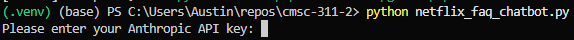
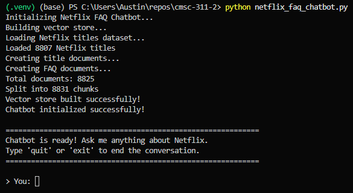
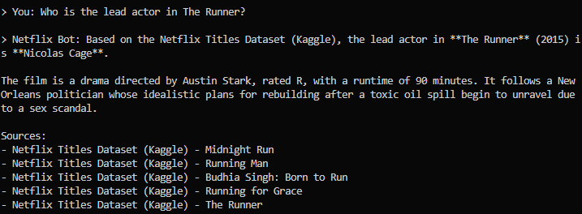
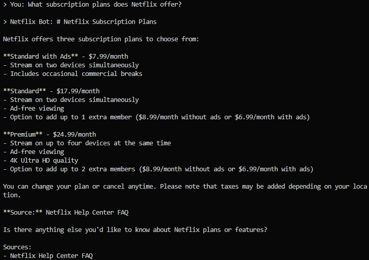
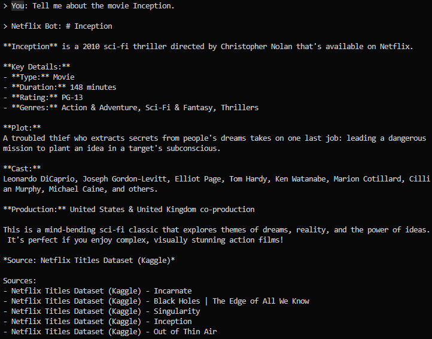
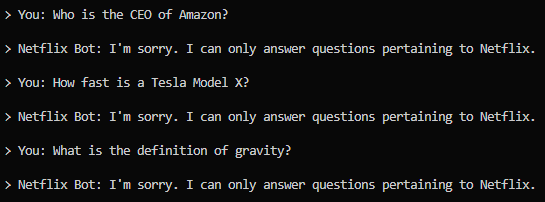

# Netflix FAQ Chatbot

[[TOC]]

## 1. Name and Purpose

The name of my chatbot is **Netflix Bot**. Its only purpose is to answer questions about Netflix as a streaming service and its catalog of movies and TV shows. If the user asks questions not pertaining to Netflix, the bot will kindly respond that they can only answer questions pertaining to Netflix. It accomplishes this by leveraging RAG, short for Retrieval-Augmented Generation. First, it creates a vector store knowledge base using scraped FAQ information from Netflix's Help page and a Kaggle dataset of its movies and TV shows. The bot then uses Anthropic's Haiku model to quickly generate natural language responses with source citations.

## 2. NLP/LLM Methods Used

The chatbot uses Anthropic's Haiku LLM model through the LangChain framework for NLP. Because this bot's primary purpose is to serve as a RAG agent, hallucinations aren't a concern since we're grounding its responses in retrieved Netflix data rather than relying solely on the LLM's training data (Lewis et al., 2021). For this reason, the less computationally expensive Haiku model was chosen to deliver immediate responses while still understanding context and generating human-like responses.

To capture semantic meaning, the chatbot uses HuggingFace's all-MiniLM-L6-v2 embedding model. This allows the chatbot to still find relevant information even when users ask a question that doesn't exactly match stored content. For example, embeddings allow similar words like "subscription" and "plan" to have similar vector representations, thus improving retrieval quality (SHAJI K, A., 2025; Reimers & Gurevych, 2019).

To efficiently find the most relevant documents, ChromaDB was used since it implements Approximate Nearest Neighbor (ANN) search algorithms. This enables NetflixBot to quickly scan thousands of documents and return the most semantically similar content (Ricadela, 2025).

To determine whether a user's query is Netflix-related, it uses an agent that uses both keyword matching and an LLM. This follows the principles of goal-based agents that "evaluate different action sequences based on how they contribute to goal achievement" (SHAJI K, A., 2025).

To organize how the chatbot searches for information and passes it to the LLM, LangChain is used for its prompt templates and chaining features. The system prompt defines what the chatbot is allowed to do, what tools it should use, and how it should respond.

## 3. Dataset Information

### 3.1 Dataset Source/Link

The movies and TV shows are sourced from Kaggle: <https://www.kaggle.com/datasets/shivamb/netflix-shows>

The FAQ content is sourced from the official Netflix Help Center: <https://help.netflix.com/en>

### 3.2 Number of Records

The Netflix titles dataset contains 8,807 records.

The FAQ content contains 18 records.

### 3.3 Number of Features

The dataset contains 12 features (columns).

### 3.4 Description of Features

| Feature Name | Description                                                  | Data Type |
| ------------ | ------------------------------------------------------------ | --------- |
| show_id      | Unique identifier for each title                             | String    |
| type         | Category: "Movie" or "TV Show"                               | String    |
| title        | Name of the movie or TV show                                 | String    |
| director     | Director(s) of the content                                   | String    |
| cast         | Main actors/actresses in the content                         | String    |
| country      | Country/countries where the content was produced             | String    |
| date_added   | Date when the title was added to Netflix                     | String    |
| release_year | Year the content was originally released                     | Integer   |
| rating       | Content maturity rating (e.g., PG-13, TV-MA)                 | String    |
| duration     | Length of movie in minutes or number of seasons for TV shows | String    |
| listed_in    | Genre categories the content belongs to                      | String    |
| description  | Brief synopsis of the content                                | String    |

### 3.5 Preprocessing Steps

To prepare the data for the vector store, columns with missing values are filled with empty strings to prevent NaN errors during embedding generation. Then all values are trimmed of leading and trailing whitespace. Afterwards, each Netflix title and its metadata is converted into a structured text document for optimal embedding generation, which is then then chunked every 1000 characters with a 200 character overlap via a recursive text splitter. Finally, each text chunk is converted into a dense vector to be stored in the vector store.

## 4. Libraries, Toolkits, and Frameworks

| Library/Framework            | Version  | Role                                                                                   |
| ---------------------------- | -------- | -------------------------------------------------------------------------------------- |
| **langchain-core**           | >=0.3.0  | Core framework for managing prompts, chains, agents, and retrieval pipelines.          |
| **langchain-anthropic**      | >=0.3.0  | Official LangChain integration for Anthropic’s Claude models.                          |
| **langchain-text-splitters** | >=0.3.0  | Utilities for splitting documents into chunks prior to embedding.                      |
| **langchain-chroma**         | >=0.2.0  | LangChain library for using Chroma as a vector store.                                  |
| **langchain-huggingface**    | >=1.0.0  | LangChain library for Hugging Face models.                                             |
| **anthropic**                | >=0.40.0 | Official Python client for accessing Anthropic’s Claude API.                           |
| **chromadb**                 | >=0.5.0  | Open-source vector database for storing and querying document embeddings.              |
| **sentence-transformers**    | >=2.2.0  | Library for generating semantic text embeddings using Hugging Face transformer models. |
| **pandas**                   | >=2.0.0  | Data manipulation library for loading, preprocessing, and analyzing datasets.          |

## 5. Application Design and Implementation

### Design

The application is split into three main components:

1. **Knowledge Base Module (`NetflixKnowledgeBase` class)**: This class is responsible for loading and preprocessing the Netflix titles dataset and parsing the FAQ content. This includes text sanitization, conversion of data into a structured format, generation of vector embeddings, and management of the ChromaDB vector store. It serves as the critical preprocessing pipeline that reduces noice and improves output accuracy (SHAJI K, A., 2025).

1. **Chatbot Core Module (`NetflixFAQChatbot` class)**: This class is the main controller that runs the whole chatbot and connects the AI model with the Netflix data. It checks if a user’s question is actually about Netflix, looks up relevant info from the knowledge base, and then uses the RAG pipeline to generate an answer. At the end, it formats the response and adds source citations.

1. **Interactive Interface (`main` function)**: Provides a command-line interface for user interaction.

### Data Flow

1. **Initialization Phase**: The system loads the Netflix titles CSV and the `NETFLIX_SERVICE_FAQ` content, then turns each piece of data into LangChain Document objects with metadata for source tracking. These documents are split into smaller chunks and converted into embeddings using sentence-transformers. Finally, the embeddings are then stored in ChromaDB.

1. **Query Processing Phase**: When a user asks a question, an agent first checks if it’s actually about Netflix, and if it’s not, it gives an off-topic response. If the question is valid, the system turns the query into embeddings and uses ChromaDB to search for the most relevant documents. Those retrieved documents are then used as context for the LLM to generate the final answer.

1. **Response Generation Phase**: The LLM receives the user's question along with retrieved context from the vector store. Using the system prompt, Claude generates a natural language answer based on that context. The sources are then pulled from the document metadata and added to the response at the end.

### Model Training

This chatbot uses pre-trained models instead of doing its own training. The sentence-transformer model (all-MiniLM-L6-v2) was already trained on over 1 billion sentence pairs to understand semantic similarity. Claude was trained by Anthropic on a wide range of text so it can handle general language understanding.

### Prediction

The “prediction” in this system happens when Claude generates the response, where it predicts the most helpful answer based on the user’s question and the retrieved context. It uses autoregressive generation where each token is generated based on previously generated tokens (Samaroo, A., 2025).

## 6. Instructions for Running the Chatbot

### Prerequisites

- Python 3.9.
- An [Anthropic API key](https://platform.claude.com/settings/keys).
- About 2GB of disk space for dependencies and the vector database.

### Installation

```bash
# 1. Create a virtual environment
python -m venv .venv
.venv\Scripts\activate # Windows
source .venv/bin/activate  # Linux / macOS

# 2. Install dependencies
pip install -r requirements.txt
```

### Running the Chatbot

```bash
python netflix_faq_chatbot.py
```

The chatbot will initialize first, which may take 1–2 minutes on the first run while it builds the vector store, and then it will show an interactive prompt for the user.

### API Key

You have 3 options for API key configuration:

1. Set your Anthropic API key as an [environment variable](https://support.claude.com/en/articles/12304248-managing-api-key-environment-variables-in-claude-code).
1. If there's no environment variable, you will be prompted for one:

   

1. Alternatively, add it directly in the main function by changing the `api_key` variable.

### Data File Placement

Ensure the `netflix_titles.csv` file is in the project directory or update the path in the code.

## 7. Results

### Initialization



### Netflix Questions







### Non-Netflix Questions



## 8. Discussion and Insights

### Model Performance

The chatbot does a good job handling Netflix-related questions. Since it uses a RAG, the responses come from actual data instead of just what the language model was trained on. This also makes it easier for users to ask questions in natural language without needing to use exact keywords. Source citations add transparency and make it easier for users to verify the LLM. The query classifying agent effectively removes off-topic questions but still accepts variations in how users ask things. The modular setup makes updating the knowledge base simple and doesn't require retraining.

### Limitations

The chatbot can only answer questions based on the dataset and FAQ content it was given, meaning it cannot handle questions about recent Netflix additions that are not in the data. Sometimes the vector search pulls in documents that are only somewhat relevant, which can cause answers to be a little off. Startup time is also noticeable since embeddings have to be generated for every document. The system also needs an internet connection in order to call the Claude API. The query classifier could also be improved. I noticed that sometimes it will think a question doesn't pertain to Netflix when it really does. For example, "who's the lead role in The Runner?" fails but "who's the lead actor in The Runner?" succeeds.

### Potential Improvements

Using a caching system could help store frequent query results, which would lower API costs and reduce latency. Adding conversation memory would let the chatbot handle follow-up questions and keep track of context over multiple interactions. Integrating with Netflix's API would allow access to real-time catalog data. Adding a reranker could improve the chatbot by reordering retrieved documents so the most relevant ones are prioritized before generating a response. This would help reduce off-topic or weak matches from vector search and lead to more accurate and focused answers (Shah et al., 2026).

## 9. References

Bansal, S. (2021). Netflix Movies and TV Shows. <Www.kaggle.com>. <https://www.kaggle.com/datasets/shivamb/netflix-shows>

Chase, H. (2023). _LangChain: Building applications with LLMs through composability_. <https://python.langchain.com/>

Chroma. (2024). _ChromaDB: The AI-native open-source embedding database_. <https://www.trychroma.com/>

Documentation. (2025). Claude Docs. <https://platform.claude.com/docs/en/home>

Lewis, P., Perez, E., Piktus, A., Petroni, F., Karpukhin, V., Goyal, N., Küttler, H., Lewis, M., Yih, W., Rocktäschel, T., Riedel, S., & Kiela, D. (2021, April 12). Retrieval-Augmented Generation for Knowledge-Intensive NLP Tasks. ArXiv.org. <https://doi.org/10.48550/arXiv.2005.11401>

Netflix. (2019). Netflix Help Center. Netflix.com. <https://help.netflix.com/en>

Reimers, N., & Gurevych, I. (2019). Sentence-BERT: Sentence Embeddings using Siamese BERT-Networks. ArXiv.org. <https://arxiv.org/abs/1908.10084>

Ricadela, A. (2025, April 15). What Is Chroma? An Open Source Embedded Database. Oracle.com; Oracle. <https://www.oracle.com/database/vector-database/chromadb/>

Samaroo, A. (2025, July 8) What is a Large Language Model (LLM)? Study.com. <https://study.com/academy/lesson/what-is-an-large-language-model-llm.html>

Shah, D., Badhe, S., & Kathrotia, N. (2026). Taxonomy of the Retrieval System Framework: Pitfalls and Paradigms. ArXiv.org. <https://arxiv.org/abs/2601.20131>

SHAJI K, A. (2025, December 2) Intelligent Agents: Definition, Components & Environments. Study.com. <https://study.com/academy/lesson/intelligent-agents-definition-components-environments.html>

SHAJI K, A. (2025, December 2) Modern NLP Pipelines | Tokenization, Embeddings, & Attention Mechanisms. Study.com. <https://study.com/academy/lesson/modern-nlp-pipelines-tokenization-embeddings-attention-mechanisms.html>

SHAJI K, A. (2025, December 2) Sentiment Analysis and Text Classification with Python. Study.com. <https://study.com/academy/lesson/sentiment-analysis-and-text-classification-with-python.html>
